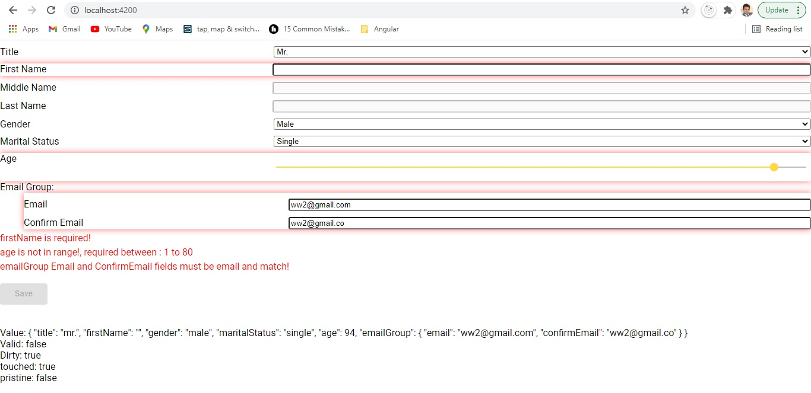

<p>
<p><p align="center">
  
</p>

<p align="center">
  Schema based dynamic form build for Angular Reactive forms
</p>

**Which Version to use?**

| Angular version | Formly version         |
| --------------- | ---------------------- |
| Angular >= 9.1   | `@dynamic-form-schema@0.x` |


* Supports modern JavaScript: ES5, ES2019.

## User Guide

Globally install `dynamic-form-schema` using the [npm](https://www.npmjs.com/) package manager:

```sh
$ npm install -g dynamic-form-schema
```

# Dynamic-Form-Schema

Dynamic-form-schema uses Angular reactive forms to create form model when component is initialized. Schema provides definition of form model (The form model is the source of truth for the control). Dynamic-form-schema can create complex form model (Create a nested form group) and all can be defined in a simple schema. Form model and nested FormGroup models can be defined in plain json schema.

This gives you more flexibility, where Dynamic-form-schema generate form model for you-based on your schema, and then you are free to link/bind the control model to the control by using Angular reactive forms [FormControlName](https://angular.io/api/forms/FormControlName). Added to it in Schema, you can also add other logic: default values, control options, validations, control enabling/disabling logic, options and validations based on conditions.

**Features:**
- No dependency on View logic - Schema only create form model.
- Simply derive/extend your component from `ControlPresenterBase` class, inject `ControlService` in the constructor and then provide schema in `ngOnInit()`

```
  ngOnInit() {
    this.onInit(schema); // onInit is a ControlPresenterBase base class function
  }
```
- Schema defines list of `controls`(of `controlType`: 'dropdown', 'input', 'mat-slider' or any other) - controls could be native, Angular or any other third party control.
- Schema also defines controls:
    * `defaultValidations`: Defines control default value at the time of initialization.
    * `conditionalDisabled`: Defines controls enabling/disabling at run time based on other controls' value. 
    * `conditionalOptions`: Defines controls selected option value based on other controls' selected value at run time. 
    * `conditionalValidations`: Defines controls change in validation rules(for example: Required) based on selected value on other control at run time.


<p><p align="center">
  
</p>


### Example Schema would look like below:

```html
export const schema = {
    "controls": [
        { key: 'title', label: 'Title', value: 'mr.', disabled: false, controlType: 'dropdown', options: [
                { key: 'mr.',  value: 'Mr.'},
                { key: 'miss.',  value: 'Miss.'},
                { key: 'mrs.',   value: 'Mrs.'},
                { key: 'master',   value: 'Master'},
                { key: 'ms.', value: 'Ms.'}
            ],
            order: 1
        },
        { key: 'firstName', label: 'First Name', value:'', disabled: false, controlType: 'input', type: 'text', order: 2 },
        { key: 'middleName', label: 'Middle Name', value:'', disabled: true, controlType: 'input', type: 'text', order: 3 },
        { key: 'gender', label: 'Gender', value:'male', disabled: false, controlType: 'dropdown', options: [
                { key: 'male',  value: 'Male'},
                { key: 'female',  value: 'Female'}
            ], 
            order: 5 
        },
        { key: 'maritalStatus', label: 'Marital Status', value:'', disabled: false, controlType: 'dropdown', options: [
                { key: 'married',   value: 'Married'},
                { key: 'single', value: 'Single'}
            ], 
            order: 6
        },
        { key: 'lastName', label: 'Last Name', value:'', disabled: true, controlType: 'input', type: 'text', order: 4 },
        { key: 'age', label: 'Age', value: 10, disabled: false, controlType: 'mat-slider', order: 7 },
        { key: 'emailGroup', label: 'Email Group:', controlType: 'formgroup', order: 8, controls: [
            { key: 'email', label: 'Email', value:'ww', disabled: false, controlType: 'input', type: 'email', order: 1, groupName: 'emailGroup' },
            { key: 'confirmEmail', label: 'Confirm Email', value: 'ww2', disabled: false, controlType: 'input', type: 'email', order: 2, groupName: 'emailGroup' }
        ]}
      ],
    "defaultValidations": {
        'title': [
            { name: 'required' },
            { name: 'minLength', args: [3] }
        ],
        'firstName': [
            { name: 'required' },
            { name: 'minLength', args: [3] },
            { name: 'maxLength', args: [50] }
        ],
        'age': [
            { name: 'range', args: [1, 80] }
        ],
        'email': [
            { name: 'required' },
            { name: 'maxLength', args: [30] }
        ]
    },
    "conditionalDisabled": {
        "firstName": [
            {
                "id": "firstName-age",
                "condition": "equalTo",
                "value": [""],
                "targetControlNames": [ "middleName", "lastName" ],
                "disabled": true,
                "emptyIt": true
            }
        ],
        "title": [
            {
                "id": "title-maritalStatus",
                "condition": "equalTo",
                "value": ["master", "miss."],
                "targetControlNames": [ "maritalStatus" ],
                "disabled": true,
                "emptyIt": true,
                "disabledValues": [ "single" ]
            }
        ]
    },
    "conditionalOptions": {
        "title": [
            {
                "id": "title-gender-male",
                "condition": "equalTo",
                "value": ["mr.", "master"],
                "targetControlName": "gender",
                "optionValue": "male"
            },
            {
                "id": "title-gender-female",
                "condition": "equalTo",
                "value": ["mrs.", "ms.", "miss."],
                "targetControlName": "gender",
                "optionValue": "female"
            },
            {
                "id": "title-maritalStatus-Married",
                "condition": "equalTo",
                "value": ["mrs."],
                "targetControlName": "maritalStatus",
                "optionValue": "married"
            }
        ]
    },
    "conditionalValidations": {
       "gender": [
            {
                "id": "gender-maritalStatus",
                "condition": "equalTo",
                "value": ["male"],
                "targetControlName": "maritalStatus",
                "validations": [ 
                    {
                        "name": "required"
                    }
                ]
            }
        ],
        "title": [
            {
                "id": "title-maritalStatus",
                "condition": "equalTo",
                "value": ["ms."],
                "targetControlName": "maritalStatus",
                "validations": [
                    {
                        "name": "required"
                    }
                ]
            }
        ]
    }
}
```

# Extend 

You can provide your own implementation for validations, validators, error messages, styles and compare map by overriding below abstract functions in your own custom drive class. You can drive ControlService or ControlServiceBase classes. Abstract functions are declared in the ControlServiceBase abstract class. ControlService already drive ControlServiceBase and provide default implementations for the abstract functions:

## Abstract functions:

### validationMap(): IDictionary<any>:
You may need to create a map for custom validations and validators. For example, check emailGroup in the above example json schema. emailGroup maps to get a validator from getValidatorFn function. You can also override getValidatorFn function or add to existing list as shown below.

  ```  
  public validationMap(): IDictionary<any> {
    return {
      required: (args: any[]) => Validators.required,
      minLength: (args: number[]) => Validators.minLength(args[0]),
      maxLength: (args: number[]) => Validators.maxLength(args[0]),
      range: (args: number[]) => this.getValidatorFn('range', args),
    };
  } 
  ```
You can override validationMap() function in your custom drive class and add to existing ControlService validationMap() function implementation as under:
  
  ```  
  public validationMap(): IDictionary<any> {
    return {
      ...super.validationMap(),
      emailGroup: (args: any[]) => this.getValidatorFn('emailGroup')
    };
  }
  ```

### public comparerMap: IDictionary<any>:
Mapping is used to process conditional Validations, since, in schema "conditionalOptions", "conditionalDisabled" condition types are used. In ControlService, below four conditions are provided as show in the implementation below, you can override and provide your own
  ```
  public comparerMap: IDictionary<any> = {
    equalTo: (args: any[]): Boolean => args[0] === args[1],
    notEqualTo: (args: any[]): Boolean => args[0] !== args[1],
    isNull: (args: any[]): Boolean => args[0] === null,
    isNotNull: (args: any[]): Boolean => args[0] !== null,
  };
  ```

### public calculateStyles(formGroup: FormGroup, key: string):
This function provides style implementation as shown in the implementation below, you can override and provide your own:
  ```
  calculateStyles(formGroup: FormGroup, key: string) {
    const control = this.getControlfromFromGroup(formGroup, key); 
    return !this.hasControlValid(control) ? {
      'border-color': '#FF1A1A',
      'box-shadow' : '0 0 10px #ff6666',
      'border-radius': '3px',
      'flex': '2'
    }
    :
    {
      'flex': '2'
    }
  }
  
  ```
  
  ### public abstract getErrors(formGroup: FormGroup):
  This function returns custom error for the validation, you can override and provide your   own:
  ```
    public getErrors(formGroup: FormGroup) {
    return this.getFormValidationErrors(formGroup.controls).map((error) => {
      switch (error.errorName) {
        case 'required':
          return `${error.controlName} is required!`;
        case 'pattern':
          return `${error.controlName} has wrong pattern!`;
        case 'email':
          return `${error.controlName} has wrong email format!`;
        case 'minlength':
          return `${error.controlName} has wrong length!, required min length: ${error.errorValue.requiredLength}`;
        case 'maxlength':
          return `${error.controlName} has wrong length!, required max length: ${error.errorValue.requiredLength}`;
        case 'areEqual':
          return `${error.controlName} must be equal!`;
        case 'range':
          return `${error.controlName} is not in range!, required between : ${error.errorValue[0]} to ${error.errorValue[1]}`;
        case 'emailsNotMatched':
          return `${error.controlName} Email and ConfirmEmail fields must be email and match!`;
        default:
          return `${error.controlName}: ${error.errorName}: ${error.errorValue}`;
      }
    });
  }
```
### public abstract getValidatorFn(name: string): ValidatorFn:
You can define validations and validators in this function and map in above validationMap() function. Two validations and validators are already provided, you can override and extend it as you please:
  ```
    public getValidatorFn(name: string, args: any[] = null): ValidatorFn {
    switch (name) {
      case 'range':
        return (c: AbstractControl): { [key: string]: number[] } | null => {
          if ( c.value !== null && (isNaN(c.value) || c.value < args[0] || c.value > args[1])) {
            return { range: [args[0], args[1]] };
          }
  
          return null;
        };

      case 'emailGroup':
        return (c: AbstractControl): { [key: string]: boolean } | null => {
          if (c instanceof FormGroup) {
            // Validate emails matches, make sure control matches
            const emailControl = c.get('email');
            const confirmControl = c.get('confirmEmail');
  
            if (!emailControl.touched || !confirmControl.touched) {
              return null;
            }
  
            if (emailControl.value === confirmControl.value) {
              return null;
            }
  
            return { emailsNotMatched: true };
          }
  
          return null;
        };

      default:
        return null;
    }
  }
```


## `updateActiveControls ControlPresenterBase` Base Class function:
One's form model is initialised by the `onInit()` function then it wasn't possible to update form model for data returned later, that was called asynchronous. Therefore, the new updateActiveControls function in the  `ControlPresenterBase` Base Class updates the form model.
You need to pass new controls collection - `controls: ControlModel[]`
In the below example, Dropdown options data (`this.getOptionsData`) is returned asynchronous by the api:

```
  @Input() set controlSchema(schema: ControlSchema) {
    if (schema) {
      if (schema.controls.length) {
        const itemswithDynamicKeywords = schema.controls.filter(x => x.dynamic === true)
        .map(x => x.dynamicKeyword);

        if (itemswithDynamicKeywords?.length) {
          this.getOptionsData(itemswithDynamicKeywords).pipe(
            observeOn(asapScheduler)
            ).subscribe(
            (x: IDictionary<{id: number, name: string}[]>)  => {
            let newControls = [...schema.controls];
            itemswithDynamicKeywords.forEach(item => {
              if (item in x) {
                const masterData = x[item];
                console.log(masterData);
                const options = masterData.map(item => ({ key: item.id?.toString(), value: item.name}));
                const control = schema.controls.find(x => x.dynamicKeyword === item);
                const updatedControl: ControlModel = { ...control, options: options };
                newControls = [...newControls.filter(x => x.dynamicKeyword !== item), updatedControl];
              }
            })
            this.updateActiveControls(newControls);
          });
        }
      }

      this.onInit(schema);
    }
  }
```

## Build

This library was generated with [Angular CLI](https://github.com/angular/angular-cli) version 9.1.12.

Run `ng build dynamic-form-schema` to build the project. The build artifacts will be stored in the `dist/` directory.

## Publishing

- Go to projects/dynamic-form-schema folder `cd projects/dynamic-form-schema` 
- run `npm version patch`
- After building your library with `ng build dynamic-form-schema`, go to the dist folder `cd dist/- - dynamic-form-schema` and run `npm publish`.

## Further help

To get more help on the Angular CLI use `ng help` or go check out the [Angular CLI Overview and Command Reference](https://angular.io/cli) page.

## Example:

You can find working example under [example folder](example/README.md)
